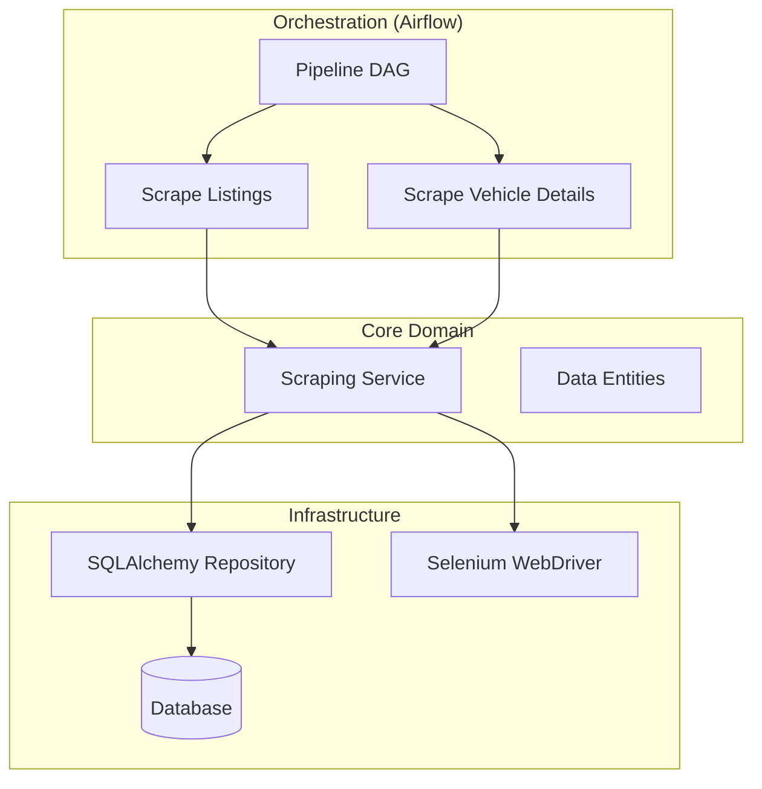

# 🚗 CarScout Pipeline

[](https://python.org)
[](https://github.com/chahinMalek/carscout_pipe/actions/workflows/ci.yml)
[](https://github.com/chahinMalek/carscout_pipe/actions)
[](https://github.com/chahinMalek/carscout_pipe/actions)
[](LICENSE)
[](https://github.com/astral-sh/ruff)

**Local Web Scraping Pipeline for Vehicle Listings**

[Overview](#-overview) • [Features](#-features) • [Architecture](#-architecture) • [Getting Started](#-getting-started) • [Contributing](#-contributing)

---

## 📖 Overview

**CarScout Pipeline** is a robust, local-first solution designed to scrape, process, and catalogue vehicle listings from [olx.ba](https://olx.ba). Built with modern Python practices, it leverages **Apache Airflow** for orchestration and **Selenium/HTTPX** for resilient data extraction.

It solves the problem of ephemeral listing data by building a historic dataset of vehicle pricing and specifications for market analysis.

## ✨ Features

- **🛡 Resilient Scraping**: Hybrid approach using Selenium (for JS-heavy listings) and HTTPX (for fast API/HTML retrieval), with built-in retries and session management.
- **🏗 Clean Architecture**: Strict separation of concerns keeping domain logic (`core`) isolated from infrastructure (`infra`).
- **🧩 Modular Design**: Fully containerized with dependency injection via `dependency-injector`.
- **⚙️ Orchestrated Workflows**: Apache Airflow DAGs manage the two-stage pipeline (Listings → Vehicles) with error tracking and backfills.
- **💾 Relational Storage**: Data is structured and validated before storage in SQLite (scalable to Postgres).

## 🏗 Architecture



## 📂 Project Structure

```text
carscout_pipe/
├── 📂 airflow/       # Airflow DAGs and plugins
├── 📂 core/          # Domain entities, services, and interfaces
│   ├── entities/
│   ├── services/
│   └── repositories/ # Abstract repository definitions
├── 📂 infra/         # Infrastructure implementations
│   ├── db/           # Database models and sessions
│   ├── scraping/     # Selenium/HTTPX drivers
│   └── containers.py # Dependency storage
├── 📂 tests/         # Pytest suite
└── 📄 docker-compose.yml
```

## 🚀 Getting Started

### Prerequisites
*   **Python 3.11+**
*   **Docker**
*   **uv** (recommended for package management)

### Installation

1.  **Clone the repository**:
    ```bash
    git clone https://github.com/your-username/carscout_pipe.git
    cd carscout_pipe
    ```

2.  **Setup Environment**:
    ```bash
    uv sync
    cp .env.example .env
    ```

3.  **Launch the Pipeline**:
    ```bash
    docker-compose up -d
    ```
    Access Airflow at `http://localhost:8080` (User/Pass: `admin`/`admin`).

## 🗺 Roadmap

Check out our [ROADMAP](docs/ROADMAP.md) for planned features and future improvements.

## 🤝 Contributing

Looking to contribute to CarScout Pipeline? Please see [CONTRIBUTING](docs/CONTRIBUTING.md) for details on how to get started.

## 📄 License

Distributed under the MIT License. See [LICENSE](LICENSE) for more information.
