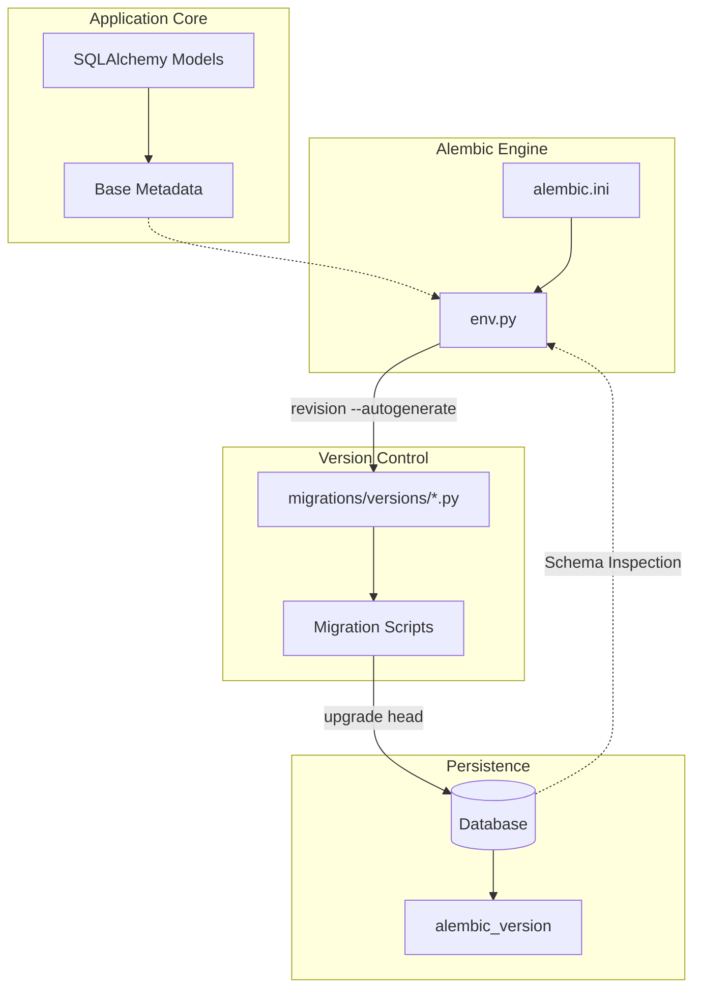

# 🛠 Database Migrations

This directory contains the database migration logic managed by **Alembic**. It ensures that the database schema is kept in sync with the SQLAlchemy models defined in the application.

## 🏗 Migration Architecture



## 🚀 Usage Guide

### 1. Generating a Migration
After modifying your SQLAlchemy models in `infra/db/models/`, you need to generate a new migration script:

```bash
# Generate a new migration automatically
alembic revision --autogenerate -m "add_user_table"
```

*Note: Always review the generated script in `migrations/versions/` to ensure it matches your intentions.*

### 2. Applying Migrations
To update your database to the latest schema:

```bash
# Upgrade to the latest version
alembic upgrade head
```

### 3. Downgrading
If you need to revert a migration:

```bash
# Revert the last migration
alembic downgrade -1
```

## 📂 Structure
- `env.py`: The entry point for Alembic that configures the SQLAlchemy engine and connects models.
- `script.py.mako`: Template for creating new migration files.
- `versions/`: Directory containing all migration scripts.
